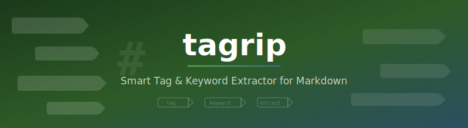

[](https://github.com/izag8216/tagrip)

[](https://python.org)
[](LICENSE)
[](tests/)
[](tests/)

**[English](README.md)**

Markdownファイル用のスマートタグ・キーワード抽出ツール。TF-IDF + RAKE + 構造シグナル（見出し、Wikilink、コードブロック）を組み合わせて関連タグを生成し、YAMLフロントマターに書き込みます。既存タグの語彙学習機能付き。

## 特徴

- **マルチシグナル抽出** -- TF-IDF、RAKEフレーズ、見出しブースト、Wikilink検出、コード言語シグナル
- **フロントマター対応** -- 他のフィールドに影響なくYAML frontmatterのtagsを読み書き
- **語彙学習** -- vault全体をスキャンしてタグ語彙を構築、同義語を自動マッピング
- **ドライランモード** -- 実際に書き込む前に変更をプレビュー
- **バッチ処理** -- ディレクトリ単位でまとめてタグ適用
- **IDF重み付け** -- コーパスレベルのIDFキャッシュで精度向上
- **CJK対応** -- 日本語・中国語テキストを英語と併用可能
- **ゼロ設定** -- APIキーやクラウドサービス不要ですぐ動作

## インストール

```bash
pip install tagrip
```

[pipx](https://pypa.github.io/pipx/) を使う場合（CLIツールに推奨）:

```bash
pipx install tagrip
```

ソースから:

```bash
git clone https://github.com/izag8216/tagrip.git
cd tagrip
pip install -e .
```

## 基本的な使い方

```bash
# markdownファイルからキーワードを抽出
tagrip extract article.md

# タグ適用をプレビュー（ドライラン）
tagrip apply article.md --dry-run

# 単一ファイルにタグを適用
tagrip apply article.md

# vault全体にタグを適用
tagrip apply ./vault/ --dry-run
tagrip apply ./vault/ --idf

# 既存タグから語彙を学習
tagrip learn ./vault/ --min-freq 2

# 語彙を使ったタグマッピング
tagrip extract article.md --vocab ~/.tagrip/vocabulary.json
tagrip apply ./vault/ --vocab ~/.tagrip/vocabulary.json

# JSON形式で出力
tagrip extract article.md --format json

# リスト形式で出力（上位5件）
tagrip extract article.md --format list -n 5
```

## コマンド

| コマンド | 説明 |
|---------|------|
| `extract <path>` | markdownファイルからキーワードを抽出 |
| `apply <path>` | 抽出したタグをファイルに適用 |
| `learn <dir>` | フロントマターからタグ語彙を構築 |

### extract オプション

| オプション | デフォルト | 説明 |
|-----------|-----------|------|
| `--max`, `-n` | 15 | 抽出するキーワードの最大数 |
| `--format` | `table` | 出力形式: `table`, `json`, `list` |
| `--vocab` | なし | タグマッピング用の語彙ファイル |

### apply オプション

| オプション | デフォルト | 説明 |
|-----------|-----------|------|
| `--dry-run` | オフ | 変更をプレビュー（書き込みなし） |
| `--max`, `-n` | 10 | ファイルごとの最大タグ数 |
| `--vocab` | なし | 語彙ファイル |
| `--idf` | オフ | 精度向上のためIDFキャッシュを構築 |
| `--merge` | オン | 既存タグと統合 |
| `--replace` | オフ | 既存タグを完全に置き換え |

### learn オプション

| オプション | デフォルト | 説明 |
|-----------|-----------|------|
| `--min-freq` | 2 | 含めるタグの最小出現頻度 |
| `--output`, `-o` | `~/.tagrip/vocabulary.json` | 語彙ファイルの出力先 |

## 仕組み

1. **パース** -- markdownファイルを読み込み、YAMLフロントマターと本文を分離
2. **クリーン** -- 解析のためにマークダウン記法（コードブロック、リンク、書式）を除去
3. **トークン化** -- CJK文字対応でテキストを単語に分割
4. **スコアリング** -- 3つのシグナルを組み合わせて評価:
   - **TF-IDF** (40%) -- 単語出現頻度 + オプションのコーパスレベルIDF重み付け
   - **RAKE** (30%) -- 複数語フレーズの自動キーワード抽出
   - **構造シグナル** -- 見出しテキスト (+0.5)、Wikilink (+0.6)、コード言語 (+0.3)
5. **マッピング** -- 語彙マッピングでタグを正規化（例: `js` -> `javascript`）
6. **適用** -- 他のYAMLフィールドを保持してタグをフロントマターに書き込み

## 動作環境

- Python 3.10+
- 依存パッケージ: click, rich, pyyaml, scikit-learn, rake-nltk, nltk

## ライセンス

MIT License -- 詳細は [LICENSE](LICENSE) を参照。
